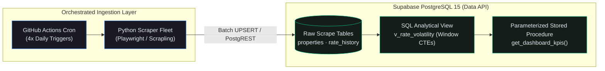
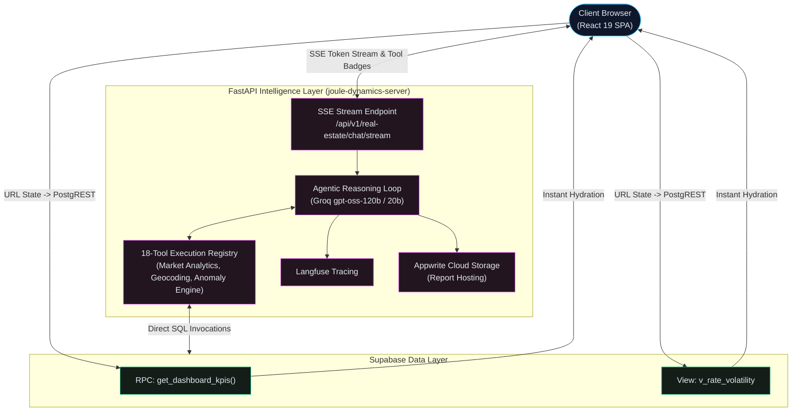
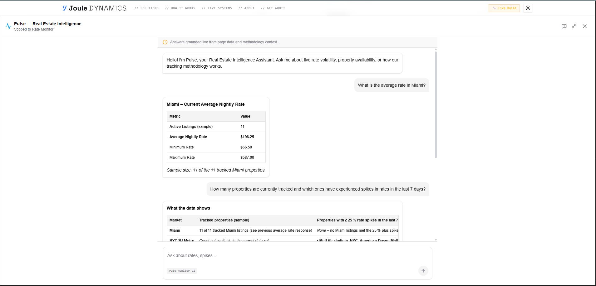
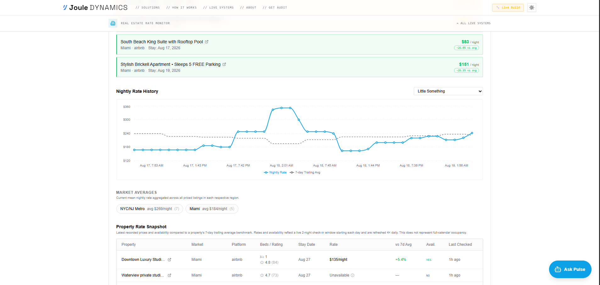
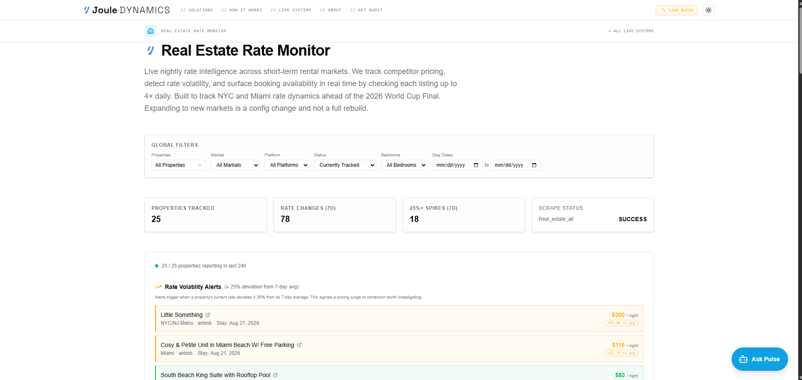
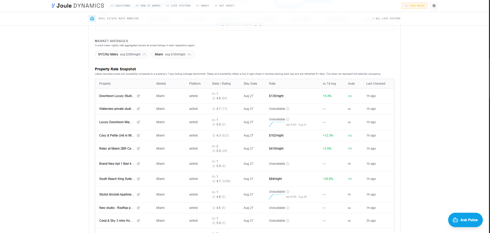
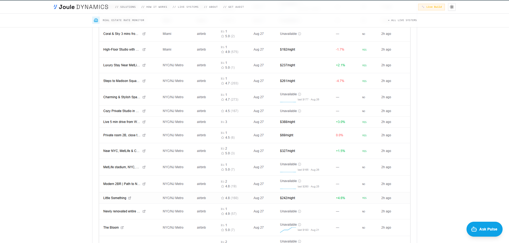
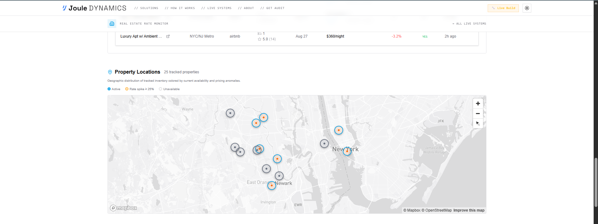

# Joule Dynamics // Enterprise Data & AI Intelligence Platform

[](https://www.jouledynamics.me)
[](https://www.jouledynamics.me/real-estate)
[](https://github.com/JohnJodinho/joule-dynamics-server)
[](https://react.dev/)
[](https://www.typescriptlang.org/)
[](https://vitejs.dev/)
[](https://supabase.com/)
[](https://fastapi.tiangolo.com/)
[](https://tailwindcss.com/)
[](https://langfuse.com/)

---

## Executive Summary

**Joule Dynamics** is an enterprise-grade data engineering and agentic intelligence platform designed for automated web-scale ingestion, statistical anomaly detection, and real-time conversational analysis.

The platform is anchored around its flagship production infrastructure: the **Real Estate Rate Monitor** ([Live Dashboard](https://www.jouledynamics.me/real-estate) | [Backend Repository](https://github.com/JohnJodinho/joule-dynamics-server)). The system monitors high-volatility short-term rental markets (Airbnb/Vrbo) in major metropolitan areas, continuously computing rolling pricing benchmarks, isolating rate surges, and providing natural language data synthesis through an autonomous AI reasoning loop.

Joule Dynamics decouples compute and presentation across a high-performance **Dual-API Architecture**:
1. **The Data API (Supabase PostgreSQL 15)**: Handles automated batch ingestion, statistical window functions, time-series rolling averages, and sub-millisecond server-side parameterized filtering via custom PL/pgSQL RPCs.
2. **The Intelligence API (FastAPI + Groq + Langfuse)**: Orchestrates an autonomous agentic loop powered by high-throughput LLMs, an 18-tool execution registry for direct database inspection, and Server-Sent Events (SSE) for native chunk-by-chunk streaming.
3. **The Ingestion Pipelines (GitHub Actions / Cron)**: Executes scheduled multi-market extraction sweeps, transforming unstructured HTML/JSON into structured PostgreSQL relation schemas.
4. **The Presentation Engine (React 19 + Vite)**: A reactive client SPA driven by server-side URL parameter synchronization and a deterministic Temporal State Machine.

---

## System Architecture

Instead of routing analytical calculations through intermediate application servers, Joule Dynamics splits workloads into two specialized, high-throughput flows:

### 1. The Data Pipeline (Ingestion & Analytical Aggregation)



### 2. The Intelligence & Application Flow



---

## Architecture by Discipline

Explore how Joule Dynamics demonstrates production-grade engineering across specialized domains:

### For Data Analysts
- **Statistical Baselines**: Calculates an unweighted 7-day trailing average ($\overline{R_{7d}}$) for every listing to establish true market baselines rather than relying on noisy point-in-time rates.
- **Divergence & Anomaly Isolation**: Evaluates percentage price divergence ($\Delta\%$) on every scrape sweep to classify market behavior into normal fluctuation vs. critical surge/drop events ($|\Delta\%| \ge 25\%$).
- **Effective Occupancy Modeling**: Derives point-in-time market occupancy rates by monitoring availability states across future stay dates.
- **Multidimensional Slicing**: Instant cross-tabulation across geographic markets, platforms, bedroom counts, active tracking status, and forward-looking check-in dates.

### For Data Engineers
- **Orchestrated Ingestion**: Headless scraping pipelines orchestrated via **GitHub Actions** cron schedules 4× daily, handling rate limiting, session rotation, and schema normalization.
- **Relational Integrity**: Normalizes entity metadata (`properties`) against high-frequency time-series scrape events (`rate_history`) using foreign key constraints and indexed lookup paths.
- **In-Database Analytics**: Offloads computation from application servers directly to **PostgreSQL 15** using analytical window functions (`ROW_NUMBER() OVER (...)`, partitioned rolling averages).
- **Push-Down Filtering**: Eliminates over-fetching by encapsulating 7-dimensional filter state within a custom PL/pgSQL stored procedure (`get_dashboard_kpis`).

### For AI Engineers
- **Autonomous Agentic RAG**: Implements an iterative reasoning agent in **FastAPI** ([joule-dynamics-server](https://github.com/JohnJodinho/joule-dynamics-server)) powered by Groq-accelerated models (`gpt-oss-120b` with seamless `gpt-oss-20b` fallback).
- **18-Tool Execution Registry**: Equips the LLM with deterministic Python tools capable of querying database views, computing market snapshots, geolocating listings, and calculating anomaly distributions.
- **Native SSE Streaming**: Delivers chunk-by-chunk token streams over HTTP `text/event-stream` with dedicated lifecycle events (`status`, `tool_call`, `token`, `done`, `error`).
- **Telemetry & Tracing**: Full observability instrumented via **Langfuse**, tracking token usage, latency distribution, execution paths, and tool-call accuracy.

### For Software Engineers
- **Reactive State Management**: Built with **React 19** and **Vite 7**, leveraging URL parameters as the single source of truth (`useSearchParams`) for shareable, reproducible dashboard states.
- **Temporal UX State Machine**: Deterministically switches UI components, timestamp formatting, badges, and terminology across **Present**, **Historical**, and **Future** date contexts.
- **Geospatial Clustering**: Interactive **Leaflet** map engine supporting dynamic viewport re-centering, coordinate grouping, and availability status pins.
- **Client-Side Synthesis**: Converts streaming Markdown reports into vector PDF documents on the fly using `html2pdf.js` with zero server-side rendering bottlenecks.

---

## 1. Data Engineering & Database Architecture

The core data layer is hosted on **Supabase (PostgreSQL 15)**. The database acts as an analytical engine that continuously processes incoming scrape batches and exposes pre-aggregated views to the frontend and AI agent.

```
                          INGESTION & DATA LAYER
                                    │
    ┌───────────────────────────────┴───────────────────────────────┐
    ▼                                                               ▼
┌───────────────────────────┐                   ┌───────────────────────────┐
│ properties Table          │                   │ rate_history Table        │
│ • id (UUID, PK)           │                   │ • id (UUID, PK)           │
│ • property_name (Text)    │                   │ • property_id (UUID, FK)  │
│ • market (Text)           │───1:N Relation───►│ • stay_date (Date)        │
│ • platform (Airbnb/Vrbo)  │                   │ • nightly_rate (Numeric)  │
│ • bedrooms (Int)          │                   │ • is_available (Boolean)  │
│ • latitude / longitude    │                   │ • recorded_at (Timestamp) │
└───────────────────────────┘                   └───────────────────────────┘
                                    │
                                    ▼
┌───────────────────────────────────────────────────────────────────────────┐
│ v_rate_volatility SQL View                                                │
│ • Partitions by property_id and stay_date                                 │
│ • Computes latest nightly rate and 7-day rolling trailing average         │
│ • Calculates percentage deviation: ((rate - avg) / avg) * 100            │
└───────────────────────────────────────────────────────────────────────────┘
                                    │
                                    ▼
┌───────────────────────────────────────────────────────────────────────────┐
│ get_dashboard_kpis() Stored Procedure (RPC)                               │
│ • Accepts 7 filter arguments (market, platform, bedrooms, stay dates...)  │
│ • Returns aggregated KPI counters in sub-millisecond JSONB payloads       │
└───────────────────────────────────────────────────────────────────────────┘
```

### 1.1. Mathematical Formulation

#### 1. 7-Day Trailing Average Benchmark
For each listing $p$ and target stay date $d$, the benchmark rate represents the arithmetic mean of all recorded rates across the 7 days preceding timestamp $t$:

```math
\overline{R_{7d}}(p, d, t) = \frac{1}{K} \sum_{k=1}^{K} r_{p, d, t_k} \quad \text{where } (t - 7\text{ days}) \le t_k \le t \quad \text{and} \quad \text{available} = \text{true}
```

#### 2. Percentage Divergence ($\Delta\%$)
The rate anomaly score measures how far the latest nightly rate $R_{\text{current}}$ deviates from its historical baseline:

```math
\Delta\% = \left( \frac{R_{\text{current}} - \overline{R_{7d}}}{\overline{R_{7d}}} \right) \times 100
```

#### 3. Spike Classification Threshold
A listing is categorized as experiencing severe market volatility when the rate divergence reaches or exceeds 25%:

```math
\text{VolatilityStatus}(p) = \begin{cases} 
\text{SURGE}, & \Delta\% \ge +25.0\% \\ 
\text{DROP}, & \Delta\% \le -25.0\% \\ 
\text{STABLE}, & -25.0\% < \Delta\% < +25.0\% 
\end{cases}
```

#### 4. Effective Market Occupancy Index
Calculated across $M$ monitored properties in a target region for a specific check-in date:

```math
\text{Occ}_{\text{market}} = \left( 1 - \frac{\sum_{i=1}^M \mathbb{I}(\text{available}_i = \text{true})}{M} \right) \times 100
```

---

### 1.2. SQL Analytical View: `v_rate_volatility`

The `v_rate_volatility` view eliminates application-level aggregation by resolving deduplication, window ranking, and rolling averages in a single query:

```sql
CREATE OR REPLACE VIEW v_rate_volatility AS
WITH ranked_rates AS (
    SELECT 
        rh.property_id,
        p.property_name,
        p.market,
        p.platform,
        p.bedrooms,
        p.latitude,
        p.longitude,
        p.rating,
        p.reviews_count,
        p.is_active,
        rh.stay_date,
        rh.nightly_rate,
        rh.is_available,
        rh.recorded_at,
        ROW_NUMBER() OVER (
            PARTITION BY rh.property_id, rh.stay_date 
            ORDER BY rh.recorded_at DESC
        ) AS rn
    FROM rate_history rh
    JOIN properties p ON p.id = rh.property_id
),
trailing_calculations AS (
    SELECT 
        property_id,
        stay_date,
        AVG(nightly_rate) FILTER (WHERE is_available = true) AS trailing_avg_7d
    FROM rate_history
    WHERE recorded_at >= NOW() - INTERVAL '7 days'
    GROUP BY property_id, stay_date
)
SELECT 
    r.property_id,
    r.property_name,
    r.market,
    r.platform,
    r.bedrooms,
    r.latitude,
    r.longitude,
    r.rating,
    r.reviews_count,
    r.is_active,
    r.stay_date,
    r.nightly_rate AS current_rate,
    t.trailing_avg_7d,
    ROUND(((r.nightly_rate - t.trailing_avg_7d) / NULLIF(t.trailing_avg_7d, 0)) * 100, 2) AS pct_above_trailing_avg,
    r.is_available,
    r.recorded_at AS last_scraped_at
FROM ranked_rates r
LEFT JOIN trailing_calculations t 
    ON r.property_id = t.property_id AND r.stay_date = t.stay_date
WHERE r.rn = 1;
```

---

### 1.3. Parameterized PL/pgSQL Stored Procedure: `get_dashboard_kpis`

To maintain sub-100ms dashboard re-renders when filters change, the `get_dashboard_kpis` stored procedure executes all multi-select and date-boundary logic server-side:

```sql
CREATE OR REPLACE FUNCTION get_dashboard_kpis(
    p_market text DEFAULT 'all',
    p_platform text DEFAULT 'all',
    p_bedrooms text DEFAULT 'all',
    p_tracked text DEFAULT 'tracked',
    p_property_ids uuid[] DEFAULT NULL,
    p_start_date date DEFAULT NULL,
    p_end_date date DEFAULT NULL
)
RETURNS jsonb
LANGUAGE plpgsql
SECURITY DEFINER
AS $$
DECLARE
    v_total_properties integer;
    v_rate_changes_7d integer;
    v_spikes_7d integer;
BEGIN
    SELECT 
        COUNT(DISTINCT v.property_id),
        COUNT(DISTINCT v.property_id) FILTER (WHERE ABS(v.pct_above_trailing_avg) > 0),
        COUNT(DISTINCT v.property_id) FILTER (WHERE ABS(v.pct_above_trailing_avg) >= 25.0)
    INTO 
        v_total_properties,
        v_rate_changes_7d,
        v_spikes_7d
    FROM v_rate_volatility v
    WHERE (p_market = 'all' OR v.market = p_market)
      AND (p_platform = 'all' OR v.platform = p_platform)
      AND (p_bedrooms = 'all' OR v.bedrooms::text = p_bedrooms)
      AND (
          p_tracked = 'all' 
          OR (p_tracked = 'tracked' AND v.is_active = true)
          OR (p_tracked = 'untracked' AND v.is_active = false)
      )
      AND (p_property_ids IS NULL OR v.property_id = ANY(p_property_ids))
      AND (p_start_date IS NULL OR v.stay_date >= p_start_date)
      AND (p_end_date IS NULL OR v.stay_date <= p_end_date);

    RETURN jsonb_build_object(
        'properties_tracked', COALESCE(v_total_properties, 0),
        'rate_changes_7d', COALESCE(v_rate_changes_7d, 0),
        'spikes_7d', COALESCE(v_spikes_7d, 0),
        'scrape_status', 'Operational'
    );
END;
$$;
```

---

## 2. AI & Intelligence Layer (The Agent)

Embedded directly within the real estate interface is **Pulse**, an agentic conversational assistant powered by the dedicated [joule-dynamics-server](https://github.com/JohnJodinho/joule-dynamics-server) backend.


*Figure: Pulse Assistant executing database tool calls to synthesize market intelligence.*

.png)
*Figure: Clean Markdown responses with client-side PDF synthesis and interactive suggestion pills.*

### 2.1. Server-Sent Events (SSE) Streaming Protocol
The frontend establishes an asynchronous HTTP connection to `POST /api/v1/real-estate/chat/stream`. Responses are streamed using structured SSE events:

| Event Type | Payload Schema | UI Handler & Rendering Behavior |
|---|---|---|
| `event: status` | `{"classification": "PATH_A"}` | Triggers the dynamic status pill ("Thinking..."). |
| `event: tool_call` | `{"tool": "get_market_averages", "args": {...}}` | Maps raw tool names to human-friendly UI labels (e.g. *Fetching market averages...*). |
| `event: token` | `{"token": "The average rate..."}` | Appends characters directly to the active assistant message buffer without artificial delays. |
| `event: done` | `{"path_used": "...", "suggested_actions": [...]}` | Finalizes streaming state and renders interactive follow-up prompt chips. |
| `event: error` | `{"code": "STREAM_ERROR", "message": "..."}` | Gracefully displays inline error banners with retry capability. |

### 2.2. 18-Tool Execution Registry
The agent is equipped with 18 specialized Python tools that execute deterministic queries against the Supabase database:

```typescript
const TOOL_LABELS: Record<string, string> = {
  get_dashboard_kpis:            "Loading KPI metrics...",
  get_market_averages:           "Fetching market averages...",
  get_market_snapshot:           "Building market snapshot...",
  get_market_trend:              "Analyzing pricing trends...",
  get_spike_alerts:              "Checking spike alerts...",
  get_rate_anomaly_report:       "Scanning for anomalies...",
  get_most_volatile_properties:  "Finding volatile listings...",
  get_property_snapshot:         "Loading property profile...",
  get_property_rate_changes:     "Analyzing rate revisions...",
  compare_properties:            "Comparing properties...",
  search_properties:             "Searching listing database...",
  get_availability_rate:         "Calculating occupancy...",
  geocode_address:               "Locating address...",
  get_nearby_properties:         "Finding nearby listings...",
  get_distance_km:               "Calculating distance...",
  get_tracked_markets:           "Fetching tracked regions...",
  get_recently_changed_tracking: "Checking recent tracking...",
  generate_data_export:          "Preparing your export...",
  generate_contact_buttons:      "Generating contact options...",
  suggest_actions:               "Preparing suggested options...",
};
```

### 2.3. Enterprise Agent Features
- **Client-Side PDF Synthesis**: Intercepts generated markdown report links (`/download`), rendering side-by-side **MD** (raw Appwrite download) and **PDF** buttons (client-side DOM vector compilation via `html2pdf.js` with session IDs: `Real_Estate_Report_<session_id>.pdf`).
- **Interactive Action Pills**: Renders follow-up choices and clarification options as clickable pills with active scaling (`active:scale-95`).
- **Smart Input Guardrails**: Auto-expanding textarea (`36px` to `140px`) with custom `assistant-scrollbar`, hardcapped at 1,000 characters with progressive visual warning badges (amber at 800+, pulsing red at 1,000 max).
- **Observability**: Every LLM step, tool call execution, latency measurement, and token cost is tracked via **Langfuse**.

---

## 3. The Presentation Layer (Frontend)

Built with **React 19**, **Vite 7**, and **Tailwind CSS v4**, the frontend delivers an industrial dark telemetry interface designed for sub-100ms response times.


*Figure: Real Estate Rate Monitor complete telemetry overview.*

### 3.1. Visual System Gallery

| Component View | Screenshot | Technical Highlights |
|---|---|---|
| **Top KPI & Filters** |  | Searchable checkbox dropdown, market/platform selectors, and 4 top-line aggregation cards. |
| **Chart & Matrix** |  | Time-series rate history chart with solid rate vs. dotted 7D baseline, and market average chips. |
| **Granular Table** |  | Tabular listings with inline SVG sparklines, rating badges, and temporal availability chips. |
| **Geospatial Map** |  | Clustered Leaflet map layer with availability pins and dynamic viewport auto-centering. |

---

### 3.2. The Temporal UX State Machine

The interface implements a deterministic **Temporal State Machine** driven by the `stay_date` URL parameter. The entire page dynamically shifts its copy, badges, and rendering logic across three distinct modes:

```
                                  STAY DATES SELECTION
                                           │
         ┌─────────────────────────────────┼─────────────────────────────────┐
         ▼                                 ▼                                 ▼
┌───────────────────┐             ┌───────────────────┐             ┌───────────────────┐
│   PRESENT MODE    │             │  HISTORICAL MODE  │             │    FUTURE MODE    │
│  (Default / Today)│             │ (All Dates Past)  │             │(All Dates Future) │
└─────────┬─────────┘             └─────────┬─────────┘             └─────────┬─────────┘
          │                                 │                                 │
          ├─► Live health indicator (Green) ├─► Clock context badge (Muted)   ├─► Calendar badge (Sky Blue)
          ├─► Relative times ("3h ago")     ├─► Absolute dates ("Aug 12")     ├─► Absolute dates ("Nov 04")
          ├─► Stale warnings (>24h active)  ├─► Stale warnings disabled       ├─► Stale warnings disabled
          ├─► Badges: "YES" / "NO"          ├─► Badges: "Was Available"       ├─► Badges: "Pre-open"
          └─► "Rate Volatility Alerts"      └─► "Historical Rate Anomalies"   └─► "Projected Rate Anomalies"
```

---

## 4. Modular Proof of Concepts (Extensions)

In addition to the Real Estate Rate Monitor, the platform includes modular proof-of-concept intelligence systems demonstrating architectural flexibility:

| System | Route | Data Pipeline & Ingestion | Analytical Engine |
|---|---|---|---|
| **Pricing Intelligence Engine** | [`/live-systems#pricing`](https://www.jouledynamics.me/live-systems#pricing) | Hourly e-commerce SKU scraper | `v_category_price_index` rolls pricing into category buckets; `v_price_volatility` isolates stealth markdowns. |
| **B2B Lead Prospector** | [`/live-systems#leads`](https://www.jouledynamics.me/live-systems#leads) | Automated directory crawler | `v_lead_generation_metrics` calculates enrichment velocity and email verification rates. |
| **Customer Support Assistant** | [`/live-systems#assistant`](https://www.jouledynamics.me/live-systems#assistant) | Supabase `pgvector` store | Zero-hallucination RAG agent answering from a 15-document enterprise knowledge base. |

---

## 5. Local Development & Quickstart

### Prerequisites
- **Node.js**: `>= 20.10.0`
- **npm**: `>= 10.0.0`
- **Supabase Account**: With PostgreSQL 15 views and stored procedures deployed.

### 1. Clone & Install
```bash
# Clone the repository
git clone https://github.com/my-dev-team-collab/joule-dynamics.git
cd joule-dynamics

# Install frontend dependencies cleanly
npm install
```

### 2. Environment Configuration
Create a `.env` file in the root directory:

```env
# Supabase Data API
VITE_SUPABASE_URL=https://your-project.supabase.co
VITE_SUPABASE_ANON_KEY=your-supabase-anon-key

# Intelligence API (FastAPI backend)
VITE_BACKEND_URL=https://johnjodinho-sentimentscope.hf.space
```

### 3. Run Development Server
```bash
npm run dev
```
Navigate to `http://localhost:5173/real-estate` to interact with the Real Estate Rate Monitor.

### 4. Build for Production
```bash
npm run build
```

---

## 6. Infrastructure Links

- **Live Frontend**: [https://www.jouledynamics.me/real-estate](https://www.jouledynamics.me/real-estate)
- **Backend API Repository**: [https://github.com/JohnJodinho/joule-dynamics-server](https://github.com/JohnJodinho/joule-dynamics-server)

---

## 7. License

Distributed under the MIT License. See `LICENSE` for details.  
Built by the **Joule Dynamics Engineering Team**.
