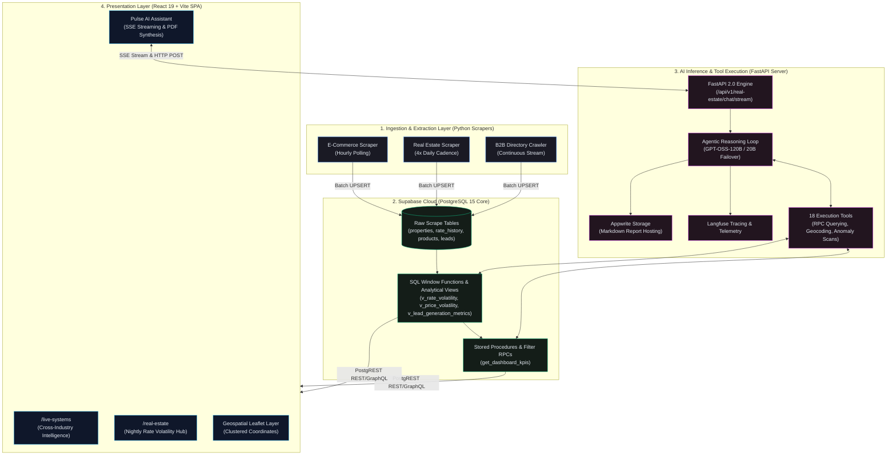
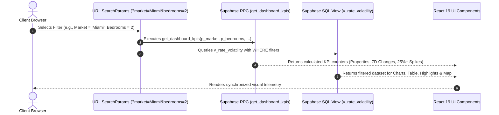
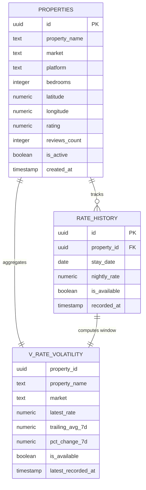

# Joule Dynamics // Enterprise AI & Data Intelligence Infrastructure

[](https://www.jouledynamics.me)
[](https://www.jouledynamics.me/real-estate)
[](https://github.com/JohnJodinho/joule-dynamics-server)
[](https://react.dev/)
[](https://www.typescriptlang.org/)
[](https://vitejs.dev/)
[](https://supabase.com/)
[](https://fastapi.tiangolo.com/)
[](https://tailwindcss.com/)
[](https://langfuse.com/)

---

## 1. Executive Summary & Architectural Overview

**Joule Dynamics** is an enterprise-grade autonomous data intelligence and real-time telemetry platform. Rather than presenting static simulations or mock portfolios, Joule Dynamics orchestrates production-scale web extraction pipelines, real-time statistical anomaly detection in PostgreSQL, and an agentic Retrieval-Augmented Generation (RAG) assistant running over Server-Sent Events (SSE).

The system bridges high-frequency web scraping engines, an enterprise database layer powered by **Supabase PostgreSQL**, a dedicated **FastAPI / Groq LLM inference backend** ([joule-dynamics-server](https://github.com/JohnJodinho/joule-dynamics-server)), and a reactive **React 19 single-page application** optimized for zero-latency dashboard filtering and live reporting.

### Global System Topology



---

## 2. The Four Live Systems Pillars (`/live-systems`)

The Joule Dynamics platform is anchored around four foundational intelligence pillars accessible on the [Live Systems Hub](https://www.jouledynamics.me/live-systems):

| Pillar | Route | Ingestion Cadence | Primary SQL Entities / Views | Primary Objective |
|---|---|---|---|---|
| **1. Pricing Intelligence Engine** | [`/live-systems#pricing`](https://www.jouledynamics.me/live-systems#pricing) | Hourly checks | `v_category_price_index`, `v_price_volatility` | Real-time e-commerce competitor SKU tracking, stock-out alerts, and stealth markdown detection. |
| **2. Real Estate Rate Monitor** | [`/real-estate`](https://www.jouledynamics.me/real-estate) | 4× daily sweeps | `v_rate_volatility`, `get_dashboard_kpis` | Nightly short-term rental rate intelligence, 7-day trailing average baselines, ±25% spike anomalies, and temporal UX projection. |
| **3. Customer Support Assistant** | [`/live-systems#assistant`](https://www.jouledynamics.me/live-systems#assistant) | Real-time RAG | Vector embeddings (pgvector), 15-doc KB | Zero-hallucination contextual support grounded strictly in product manuals, warranty terms, and shipping policies. |
| **4. B2B Lead Prospector** | [`/live-systems#leads`](https://www.jouledynamics.me/live-systems#leads) | Continuous stream | `v_lead_generation_metrics`, `leads` | Automated multi-directory scraping, email validation, ICP categorization, and enrichment velocity monitoring. |

```
                                  LIVE SYSTEMS PORTFOLIO
                                             │
         ┌───────────────────┬───────────────┴───────────────┬───────────────────┐
         ▼                   ▼                               ▼                   ▼
┌─────────────────┐ ┌─────────────────┐             ┌─────────────────┐ ┌─────────────────┐
│ E-Commerce      │ │ Real Estate     │             │ Customer RAG    │ │ B2B Lead        │
│ Pricing Monitor │ │ Rate Monitor    │             │ Support Agent   │ │ Prospector      │
│ (Hourly SKUs)   │ │ (4× Daily STRs) │             │ (Zero-Halluc.)  │ │ (ICP Enrich)    │
└─────────────────┘ └─────────────────┘             └─────────────────┘ └─────────────────┘
```

### Pillar 1: Pricing Intelligence Engine (`/live-systems#pricing`)
- **Data Model**: Normalizes SKUs across target competitors, indexing brand, current price, promotional discount flags, and in-stock booleans.
- **Analytical Layer**:
  - `v_category_price_index`: Aggregates hourly price movements across product categories to generate macro pricing indices.
  - `v_price_volatility`: Evaluates variance between current pricing and the 30-day moving average, automatically surfacing stealth markdowns and predatory price shifts.
- **Frontend Presentation**: Interactive Recharts time-series visualizer showing intraday pricing curves against rolling baselines.

### Pillar 3: Customer Support Assistant (`/live-systems#assistant`)
- **Knowledge Architecture**: Ingests 15 domain-specific documents (return rules, international shipping logistics, technical specs) into Supabase `pgvector`.
- **Inference Constraints**: Employs strict prompt guardrails enforcing strict zero-hallucination rules. Unresolved queries automatically trigger a structured fallback object for human handoff.

### Pillar 4: B2B Lead Prospector (`/live-systems#leads`)
- **Ingestion Mechanics**: Scrapes targeted B2B directories, parsing company names, decision-maker roles, verified email structures, and geographic locations.
- **Analytical Layer**: `v_lead_generation_metrics` calculates real-time enrichment velocity (leads discovered per hour, verification success rates, platform distribution breakdown).

---

## 3. Deep Dive: Real Estate Rate Monitor (`/real-estate`)

> 🌐 **Live URL**: [https://www.jouledynamics.me/real-estate](https://www.jouledynamics.me/real-estate)  
> ⚙️ **Backend Repository**: [https://github.com/JohnJodinho/joule-dynamics-server](https://github.com/JohnJodinho/joule-dynamics-server)

The **Real Estate Rate Monitor** is the flagship infrastructure demonstration of Joule Dynamics. It continuously monitors short-term rental listings (Airbnb and Vrbo) in high-volatility metropolitan markets (such as NYC Metro and Miami around major event dates), providing real-time rate revision analysis, automated spike detection, temporal projection modeling, and conversational market intelligence.


---

### 3.1. Visual System Architecture & Page Layout

The dashboard is structured into an intuitive, telemetry-first layout that flows from high-level KPI aggregations down to granular geospatial coordinates:

```
┌──────────────────────────────────────────────────────────────────────────────────┐
│ [1] Sticky Navigation & Breadcrumbs                                             │
├──────────────────────────────────────────────────────────────────────────────────┤
│ [2] Page Header (Title, Subtitle, Real-Time Ingestion Status)                    │
├──────────────────────────────────────────────────────────────────────────────────┤
│ [3] Global Server-Side Filters Bar (Properties, Market, Platform, Beds, Status)  │
├──────────────────────────────────────────────────────────────────────────────────┤
│ [4] Top-Line KPI Cards (Properties Tracked, Rate Changes, 25%+ Spikes, Health)   │
├──────────────────────────────────────────────────────────────────────────────────┤
│ [5] Health Indicator & Temporal Context Mode Badge (Present / Historical / Future)│
├──────────────────────────────────────────────────────────────────────────────────┤
│ [6] Rate Volatility Highlight Cards (Top 2 Surges & Top 2 Steepest Drops)       │
├──────────────────────────────────────────────────────────────────────────────────┤
│ [7] Nightly Rate History Chart (Solid Rate vs. Dotted 7D Trailing Baseline)     │
├──────────────────────────────────────────────────────────────────────────────────┤
│ [8] Regional Market Average Badges (Mean Rates with Listing Count Sub-badges)   │
├──────────────────────────────────────────────────────────────────────────────────┤
│ [9] Property Rate Snapshot Matrix (Table with Sparklines, Avail Badges, Rating) │
├──────────────────────────────────────────────────────────────────────────────────┤
│ [10] Interactive Geospatial Map (Clustered Leaflet Layer with Custom Tooltips)   │
└──────────────────────────────────────────────────────────────────────────────────┘
```

#### Page Visual Gallery


*Figure 1: Global Filters Bar, Top-line KPI Cards, and Rate Volatility Surge/Drop Highlights.*


*Figure 2: Time-series Nightly Rate Chart with 7-Day Trailing Baseline, Regional Averages, and Detailed Property Matrix.*


*Figure 3: Granular tabular listings with embedded historical SVG sparklines and temporal availability chips.*


*Figure 4: Leaflet interactive map with coordinate clustering and real-time listing availability pins.*

---

### 3.2. Global Multi-Dimensional Filtering Architecture

The dashboard implements **Server-Side URL Parameter Filtering**. Rather than downloading monolithic payloads and filtering on the client, state changes in the UI directly mutate URL search parameters (`useSearchParams`). These parameters are pushed down to PostgreSQL RPCs and SQL views.



#### Supported Filter Matrix

| Filter Dimension | URL Param Key | Data Type | Database Mapping | Behavior & Edge Cases |
|---|---|---|---|---|
| **Property Selector** | `property_ids` | `string[]` (comma-separated) | `p.id = ANY(uuid_array)` | Multi-select checkbox dropdown with internal fuzzy search. Evaluated against the entire universe of listings. |
| **Market Region** | `market` | `string` | `p.market = :market` | Filters by designated metropolitan boundary (e.g. `Miami`, `NYC/NJ Metro`). |
| **Platform** | `platform` | `string` | `p.platform = :platform` | Filters short-term rental channels (`Airbnb`, `Vrbo`). |
| **Bedrooms** | `bedrooms` | `integer` | `p.bedrooms = :bedrooms` | Filters by unit capacity (`1`, `2`, `3+`). |
| **Status (Active)** | `tracked` | `string` | `p.is_active = :bool` | `tracked` (monitored active), `untracked` (historical decommissioned), or `all` (complete archive). |
| **Stay Dates** | `start`, `end` | `YYYY-MM-DD` | `rh.stay_date BETWEEN :start AND :end` | Targets reservation check-in date (`stay_date`), **not** the scraper timestamp (`recorded_at`). Directly drives the **Temporal UX State Machine**. |

---

### 3.3. The Temporal UX State Machine

Because short-term rental rates are tied to future reservation check-in dates as well as historical scrape logs, the dashboard features a **Temporal State Machine** that dynamically modifies visual copy, descriptions, badge colors, and column headers based on the active `stay_date` window:

```
                                  STAY DATES SELECTION
                                           │
         ┌─────────────────────────────────┼─────────────────────────────────┐
         ▼                                 ▼                                 ▼
┌───────────────────┐             ┌───────────────────┐             ┌───────────────────┐
│   PRESENT MODE    │             │  HISTORICAL MODE  │             │    FUTURE MODE    │
│  (Default / Today)│             │ (All Dates Past)  │             │(All Dates Future) │
└─────────┬─────────┘             └─────────┬─────────┘             └─────────┬─────────┘
          │                                 │                                 │
          ├─► Live health dot (Green)       ├─► Clock icon badge (Muted)      ├─► Calendar badge (Blue)
          ├─► Relative times ("3h ago")     ├─► Absolute dates ("Aug 12")     ├─► Absolute dates ("Nov 04")
          ├─► Stale warnings (>24h)         ├─► Stale warnings disabled       ├─► Stale warnings disabled
          ├─► Avail: "YES" / "NO"           ├─► Avail: "Was Available"        ├─► Avail: "Pre-open"
          └─► Volatility: "Live Anomalies"  └─► Volatility: "Historical Anom."└─► Volatility: "Projected Anom."
```

#### Detailed Temporal State Behaviors

| Feature / Element | Present Mode (Default) | Historical Mode (`end < today`) | Future Mode (`start > today`) |
|---|---|---|---|
| **Health Context Badge** | `45 / 45 properties reporting in last 24h` (Green live indicator) | `Viewing historical stay dates (Jun 01 – Jul 31)` | `Showing projected availability for future dates` |
| **Availability Badges** | `YES` (Green), `YES (STALE)` (Yellow-green), `NO` (Zinc) | `Was Available` (Teal), `Was Booked` (Rose) | `Pre-open` (Sky Blue), `Pre-booked` (Rose) |
| **Timestamp Column** | Header: `Last Checked`. Relative timestamps (`3h ago`). Rows >24h old dim to 60% opacity. | Header: `Recorded`. Absolute formatted dates (`Aug 14, 2026`). Dimming disabled. | Header: `Recorded`. Absolute dates (`Aug 21, 2026`). Dimming disabled. |
| **Volatility Card Titles** | `Rate Volatility Alerts` | `Historical Rate Anomalies` | `Projected Rate Anomalies` |
| **Chart Title Baseline** | `Nightly Rate History` | `Historical Rate Tracking` | `Rate Projections` |

---

### 3.4. Mathematical & Algorithmic Methodology

#### 1. 7-Day Trailing Average Benchmark ($\overline{R_{7d}}$)
For each listing $p$, the benchmark rate represents the unweighted arithmetic mean of all recorded rates across the preceding 7 calendar days from the scrape timestamp $t$:

$$\overline{R_{7d}}(p, t) = \frac{1}{K} \sum_{k=1}^{K} r_{p, t_k} \quad \text{where } t - 7\text{ days} \le t_k \le t$$

#### 2. Percentage Deviation from Trailing Baseline ($\Delta\%$)
The rate anomaly score measures the divergence of the most recently scraped nightly rate $R_{\text{current}}$ from the historical 7-day trailing average $\overline{R_{7d}}$:

$$\Delta\% = \left( \frac{R_{\text{current}} - \overline{R_{7d}}}{\overline{R_{7d}}} \right) \times 100$$

#### 3. Spike Alert Threshold
A property is classified as experiencing an extreme volatility event if the absolute divergence exceeds 25%:

$$\text{Spike}(p) = \begin{cases} 
\text{SURGE}, & \Delta\% \ge +25.0\% \\ 
\text{DROP}, & \Delta\% \le -25.0\% \\ 
\text{NORMAL}, & -25.0\% < \Delta\% < +25.0\% 
\end{cases}$$

#### 4. Effective Market Occupancy Index ($\text{Occ}_{\text{market}}$)
Given $M$ actively monitored listings in a target market for a specific stay date $D$:

$$\text{Occ}_{\text{market}}(D) = \left( 1 - \frac{\sum_{i=1}^M \mathbb{I}(\text{available}_i = \text{true})}{M} \right) \times 100$$

---

### 3.5. Database Architecture & SQL Definitions

The real estate data layer is powered by Supabase PostgreSQL 15, leveraging advanced window functions, CTEs, and parameterized PL/pgSQL procedures.



#### SQL View: `v_rate_volatility`
Computes running averages, lagged values, and price divergences directly inside PostgreSQL:

```sql
CREATE OR REPLACE VIEW v_rate_volatility AS
WITH ranked_rates AS (
    SELECT 
        rh.property_id,
        p.property_name,
        p.market,
        p.platform,
        p.bedrooms,
        p.latitude,
        p.longitude,
        p.rating,
        p.reviews_count,
        p.is_active,
        rh.stay_date,
        rh.nightly_rate,
        rh.is_available,
        rh.recorded_at,
        ROW_NUMBER() OVER (
            PARTITION BY rh.property_id, rh.stay_date 
            ORDER BY rh.recorded_at DESC
        ) AS rn
    FROM rate_history rh
    JOIN properties p ON p.id = rh.property_id
),
trailing_calculations AS (
    SELECT 
        property_id,
        stay_date,
        AVG(nightly_rate) FILTER (WHERE is_available = true) AS trailing_avg_7d
    FROM rate_history
    WHERE recorded_at >= NOW() - INTERVAL '7 days'
    GROUP BY property_id, stay_date
)
SELECT 
    r.property_id,
    r.property_name,
    r.market,
    r.platform,
    r.bedrooms,
    r.latitude,
    r.longitude,
    r.rating,
    r.reviews_count,
    r.is_active,
    r.stay_date,
    r.nightly_rate AS current_rate,
    t.trailing_avg_7d,
    ROUND(((r.nightly_rate - t.trailing_avg_7d) / NULLIF(t.trailing_avg_7d, 0)) * 100, 2) AS pct_above_trailing_avg,
    r.is_available,
    r.recorded_at AS last_scraped_at
FROM ranked_rates r
LEFT JOIN trailing_calculations t 
    ON r.property_id = t.property_id AND r.stay_date = t.stay_date
WHERE r.rn = 1;
```

#### Stored Procedure (RPC): `get_dashboard_kpis`
Pushes multi-select and temporal boundary filters down to the database engine:

```sql
CREATE OR REPLACE FUNCTION get_dashboard_kpis(
    p_market text DEFAULT 'all',
    p_platform text DEFAULT 'all',
    p_bedrooms text DEFAULT 'all',
    p_tracked text DEFAULT 'tracked',
    p_property_ids uuid[] DEFAULT NULL,
    p_start_date date DEFAULT NULL,
    p_end_date date DEFAULT NULL
)
RETURNS jsonb
LANGUAGE plpgsql
SECURITY DEFINER
AS $$
DECLARE
    v_total_properties integer;
    v_rate_changes_7d integer;
    v_spikes_7d integer;
BEGIN
    -- Query filtered aggregation metrics
    SELECT 
        COUNT(DISTINCT v.property_id),
        COUNT(DISTINCT v.property_id) FILTER (WHERE ABS(v.pct_above_trailing_avg) > 0),
        COUNT(DISTINCT v.property_id) FILTER (WHERE ABS(v.pct_above_trailing_avg) >= 25.0)
    INTO 
        v_total_properties,
        v_rate_changes_7d,
        v_spikes_7d
    FROM v_rate_volatility v
    WHERE (p_market = 'all' OR v.market = p_market)
      AND (p_platform = 'all' OR v.platform = p_platform)
      AND (p_bedrooms = 'all' OR v.bedrooms::text = p_bedrooms)
      AND (
          p_tracked = 'all' 
          OR (p_tracked = 'tracked' AND v.is_active = true)
          OR (p_tracked = 'untracked' AND v.is_active = false)
      )
      AND (p_property_ids IS NULL OR v.property_id = ANY(p_property_ids))
      AND (p_start_date IS NULL OR v.stay_date >= p_start_date)
      AND (p_end_date IS NULL OR v.stay_date <= p_end_date);

    RETURN jsonb_build_object(
        'properties_tracked', COALESCE(v_total_properties, 0),
        'rate_changes_7d', COALESCE(v_rate_changes_7d, 0),
        'spikes_7d', COALESCE(v_spikes_7d, 0),
        'scrape_status', 'Operational'
    );
END;
$$;
```

---

### 3.6. AI Intelligence Layer: Pulse Real Estate Assistant

Integrated into the bottom-right corner of the dashboard is **Pulse**, an enterprise agentic AI intelligence assistant scoped to real-time market data.


*Figure 5: Pulse Assistant explaining market averages and rate volatility using real-time database context.*

.png)
*Figure 6: Generated report download buttons (Markdown + Client-side synthesized PDF) and interactive follow-up pills.*

#### Core AI Capabilities & Integration Contracts

1. **Server-Sent Events (SSE) Native Streaming**:
   - Streams live tokens from the backend endpoint `POST /api/v1/real-estate/chat/stream`.
   - Employs a custom `TextDecoder` reader loop that updates React state chunk-by-chunk without artificial typing delays.

2. **18-Tool Dynamic Status Indicator**:
   - The backend reasoning loop emits `event: tool_call` with specific tool identifiers.
   - The UI transforms raw tool invocations into modern, pulsing telemetry indicators:

   ```typescript
   const TOOL_LABELS: Record<string, string> = {
     get_dashboard_kpis:            "Loading KPI metrics...",
     get_market_averages:           "Fetching market averages...",
     get_market_snapshot:           "Building market snapshot...",
     get_market_trend:              "Analyzing pricing trends...",
     get_spike_alerts:              "Checking spike alerts...",
     get_rate_anomaly_report:       "Scanning for anomalies...",
     get_most_volatile_properties:  "Finding volatile listings...",
     get_property_snapshot:         "Loading property profile...",
     get_property_rate_changes:     "Analyzing rate revisions...",
     compare_properties:            "Comparing properties...",
     search_properties:             "Searching listing database...",
     get_availability_rate:         "Calculating occupancy...",
     geocode_address:               "Locating address...",
     get_nearby_properties:         "Finding nearby listings...",
     get_distance_km:               "Calculating distance...",
     get_tracked_markets:           "Fetching tracked regions...",
     get_recently_changed_tracking: "Checking recent tracking...",
     generate_data_export:          "Preparing your export...",
     generate_contact_buttons:      "Generating contact options...",
     suggest_actions:               "Preparing suggested options...",
   };
   ```

3. **Client-Side PDF Compilation (`html2pdf.js`)**:
   - When the backend generates markdown reports (hosted in Appwrite storage), the UI intercepts `/download` links.
   - It renders dual action buttons: **MD** (direct raw download) and **PDF** (client-side DOM-to-PDF rendering saving as `Real_Estate_Report_<session_id>.pdf`).

4. **Interactive Action & Clarification Chips**:
   - Structured follow-up prompts and clarification choices emitted in `suggested_actions` render as interactive pills (`active:scale-95`).
   - Clicking a chip immediately dispatches the follow-up message into the chat session.

5. **Edge-Case Error Handling & Input Guardrails**:
   - **Network Reconnection**: Catches mid-stream disconnects and gracefully appends `[Error]` notices without clearing previously streamed text.
   - **Auto-Expanding Input**: Textarea dynamically expands from `36px` to `140px` with universal `assistant-scrollbar` styling.
   - **1,000-Character Hard Cap**: Monospace badge warns in amber at 800+ characters and pulses in red at the 1,000-character maximum.

---

## 4. Technology Stack Matrix

| Layer | Technology | Purpose & Selection Rationale |
|---|---|---|
| **Frontend Framework** | **React 19** (`react`, `react-dom`) | Concurrent rendering, modern hooks, zero-latency state transitions. |
| **Build & Tooling** | **Vite 7.3** | Lightning-fast Hot Module Replacement (HMR) and optimized Rollup tree-shaking. |
| **Styling & Design System** | **Tailwind CSS v4** + CSS Variables | High-performance CSS engine with industrial dark telemetry aesthetics. |
| **Icons & Micro-UI** | **Lucide React** | Feather-light SVG iconography. |
| **Charts & Visualizations** | **Recharts** | Declarative SVG-based time-series and area charts. |
| **Geospatial Mapping** | **Leaflet** + **React Leaflet** | Coordinate plotting, marker clustering, and interactive popups without heavy tile overhead. |
| **Markdown Rendering** | **React-Markdown** + **Remark-GFM** | Secure, sanitised GitHub-flavored Markdown rendering for AI outputs. |
| **PDF Synthesis** | **html2pdf.js** (`html2canvas` + `jsPDF`) | Client-side DOM-to-PDF vector generation for analytical reports. |
| **Database & Auth** | **Supabase (PostgreSQL 15)** | Row-level security, analytical views, stored procedures, and PostgREST. |
| **AI Inference Backend** | **FastAPI** + **Groq Cloud** | High-throughput async SSE streaming and LLM tool execution ([joule-dynamics-server](https://github.com/JohnJodinho/joule-dynamics-server)). |
| **LLM Observability** | **Langfuse** | Step-by-step trace telemetry, latency monitoring, and token cost accounting. |
| **Asset Storage** | **Appwrite Cloud** | Secure storage bucket hosting generated Markdown exports. |

---

## 5. Local Development & Quickstart

### Prerequisites
- **Node.js**: `>= 20.10.0`
- **npm**: `>= 10.0.0`
- **Supabase Account**: With PostgreSQL views and `get_dashboard_kpis` RPC deployed.

### 1. Clone & Install Dependencies
```bash
# Clone the repository
git clone https://github.com/my-dev-team-collab/joule-dynamics.git
cd joule-dynamics

# Install dependencies cleanly
npm install
```

### 2. Environment Configuration
Create a `.env` file in the root directory:

```env
# Supabase Configuration
VITE_SUPABASE_URL=https://your-project.supabase.co
VITE_SUPABASE_ANON_KEY=your-supabase-anon-key

# Optional Custom Backend URL (defaults to production Hugging Face Space)
VITE_BACKEND_URL=https://johnjodinho-sentimentscope.hf.space
```

### 3. Run Development Server
```bash
npm run dev
```
The application will launch on `http://localhost:5173`. Navigate to `http://localhost:5173/real-estate` to view the Real Estate Rate Monitor.

### 4. Build for Production
```bash
npm run build
```

---

## 6. Repository Links & Related Infrastructure

- **Frontend Production URL**: [https://www.jouledynamics.me](https://www.jouledynamics.me)
- **Real Estate Dashboard**: [https://www.jouledynamics.me/real-estate](https://www.jouledynamics.me/real-estate)
- **Backend API Repository**: [https://github.com/JohnJodinho/joule-dynamics-server](https://github.com/JohnJodinho/joule-dynamics-server)
- **Production Backend Endpoint**: `https://johnjodinho-sentimentscope.hf.space`

---

## 7. License & Compliance

Distributed under the MIT License. See `LICENSE` for full details.  
Built and maintained by the **Joule Dynamics Engineering Team**.
